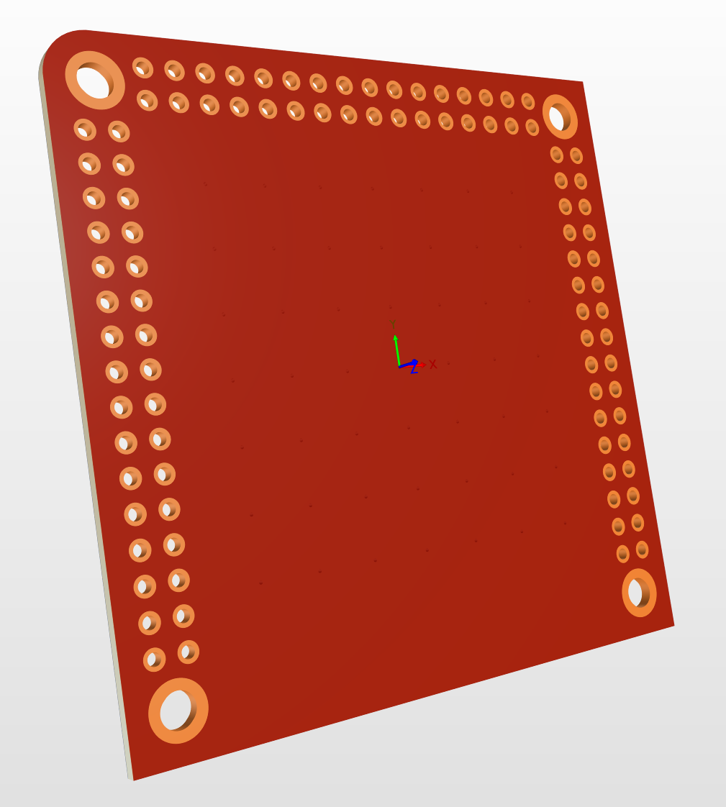

# Ceramic PCB, dual sided

- **Substrate:** Al2O3 alumina ceramics, 1mm thickness
- **Copper:** 0.5oz, bonded to substrate with DBC bonding technology
- **Copper finish:** ENIG plated
- **Soldermask:** red on top side, blue on bottom side

